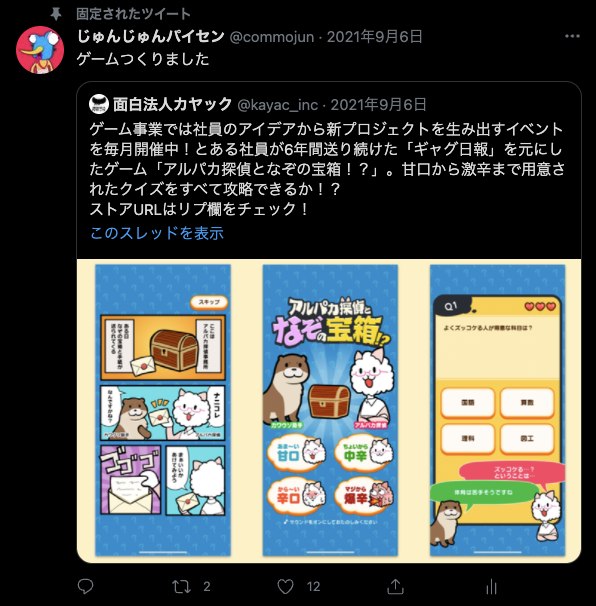

## 7年間運用したソーシャルゲームを<br>Amazon EC2構成からAmazon ECS構成へと<br>乗り換えた話

---

## 自己紹介

<br>

- 大澤 純 (@commojun)
- 2016~ サーバサイドエンジニア@KAYAC

---

アホみたいなことをつぶやいたり


---

バカゲーを作ってリリースしちゃったりしています



---

## 目次

- ぼくらの甲子園!ポケットについて
- EC2時代のサーバ構成
- なぜECSに乗り換えるか
- ホコリかぶったPerlとモジュールのバージョンアップ
- 時代に乗ったデプロイ方法にする
- 巨大プロジェクトのDockerイメージを焼く
- ゲームの心臓なのにSPOFになっていたバッチサーバの冗長化作戦
- 非エンジニアに仕事をわかってもらう

---

## ぼくらの甲子園!ポケットについて

---

ぼくらの甲子園!ポケットは2014年から運用を続けているソーシャルゲームタイトルです。

おかげさまで2021年10月で8周年を迎えることができました。

公式サイトの画像

---

### ぼくらの甲子園!ポケットの特徴

- ユーザは監督ではなく、選手である
- ユーザが9人集まらないと試合すらできない
- チームメイトの一人ひとりがユーザ
- ユーザは選手になって甲子園を目指すため、青春を追体験できる

監督 -> キャラクタ

プレイヤー　プレイヤー　みたいな絵

---

### ぼくらの甲子園!ポケットの特徴

- 2週間に1回の甲子園大会に出場するためにリーグ戦を繰り返す
- 甲子園大会はトーナメント戦で1日かけて行う
- 優勝すると、優勝チームの要望に応えた新聞を運営が作成し、ゲーム内に掲載する

試合中の絵と新聞の絵

---

### ぼくらの甲子園!ポケットの特徴

- リーグ戦の試合は毎日定刻に開始
- 参加するには決まった時間にログインしなければならない
- 作戦会議中にスキルを発動したり、仲間にエールを送ったりする
- 作戦会議が終了すると完全オートで試合が進行する
- 複雑なアクションは無く、戦況に応じてどのスキルを使うかが重要
- 打席・試合の結果は全てサーバのバッチ実行によって決定する

---

## EC2時代のサーバ構成

---

ぼくらの甲子園!ポケットは2014年9月12日リリース

当然開発はそれよりも前に開始していた。その頃の時流に乗ったサーバ構成

---

perl 5.16 on Amazon EC2 な図がどっかにないかな？

- 役割に応じたEC2インスタンスがあり、必要に応じてオートスケールをしたりする
- Aurora MySQLや、Elasticache（Redis）などマネジメントされた物を利用
- batchサーバ上でcrondが常駐して、定刻の試合開始を行っている

---

## なぜECSに乗り換えるか

---

### 1, Amazon Linuxのサポート終了

EC2上で利用しているOSのサポートが2020年末に終了するため、何かしら手を打たなければならなかった

後継OS Amazon Linux2 への乗り換えという選択肢もあるが…

---

### 2, コンテナを利用したサーバ構築が当たり前になりつつある

他のゲームタイトルなどで、Amazon ECS構成を使ったゲームサーバについて社内に知見が貯まっていた

---

### 3, このゲームの運用を10年続けたい！

長期運用タイトルにする意思が総意としてあった

リリース時から時代が変わっているので、将来性のある構成に乗り換えよう！

---

## ホコリかぶったPerlとモジュールのバージョンアップ

---

インフラ構成もだが、言語のバージョンとモジュールのバージョンも長らくメンテされていなかった

---

「図」

運用が続くとゲーム体験に関係のある部分にしか関心が向かなくなりがち

---

### Perl 5.16 👉 Perl 5.30

---

エイヤで言語バージョンを上げてみる

---

@INC問題

---

コンパイルエラーしまくる

---

テストが運で落ちたり通ったりする

管理画面の表示順シャッフルも

---

### モジュールのバージョンを上げてみる

---

### 蓋を開けてみると見えた問題

- そもそも cpanfile.snapshot でのバージョン管理がなされていなかった
- 後方互換の無いモジュールバージョンアップがうっかり混入してあわてて固定する運用
- モンキーパッチを当てたせいでバージョンを上げられない
- 日本語を含んだJSONのリクエストがどうしても上手くさばけない

---

ネストされたJSONリクエストの中に日本語が含まれていた場合、正しくエンコードされない問題

---

ネストされたJSONリクエストが正しくデコードされない問題

---

## 時代に乗ったデプロイ方法にする

---

EC2構成からECS構成へ

コンテナベースのシステムへの転換

---

最も恩恵があるのがデプロイまわり

最も変化があるのがデプロイまわり

---

### EC2構成のデプロイ方法

strecherというOSSによるpull型のデプロイツール

[EC2デプロイの図]

https://techblog.kayac.com/10_stretcher.html

- デプロイサーバがリポジトリから配布物を取得する
- デプロイサーバが配布物を全て一つのアーカイブにまとめてAmazon S3に保存する
- 各ホストがAmazon S3から配布物を取得する

---

### ECS構成のデプロイ方法


- とにかくコンテナイメージをビルドしてリポジトリに収める
- デプロイ = コンテナインスタンスの入れ替え

---

## 巨大プロジェクトのdockerイメージを焼く

---

### EC2構成でのデプロイ方法の利点

[EC2デプロイの図]

Github上でデプロイ用のブランチが準備できれば、その先のデプロイが迅速

そのスピード感に頼ってデプロイの頻度が多い運用となっていた

---

### ビルドが長い

[ECSデプロイの図2]

ブランチの準備ができてから、ビルドする時間がかかる

---

### circleciにビルドさせる

- ブランチにコミットさえすればビルドされる
- ECRへのPUSHまでのパイプライン

---

### 2階建て作戦

baseイメージとappイメージに分ける

- 夜中に依存パッケージ、モジュール、ツール類をbaseイメージでインストール
- リリース用ブランチへのコミットがある度、アプリケーションコードをコンテナにコピーする

##### Dockerfile.base
```Dockerfile
FROM perl:5.30.0-buster

RUN apt-get install 必要なソフトウェア
...
```

```bash
$ docker build -t app:base .
```

##### Dockerfile
```Dockerfile
FROM app:base

COPY ./ /home/user/repo/
...
```

```bash
$ docker build -t app .
```

運用上必要な箇所のみにコンテナイメージビルドの時間をかける

---

## ゲームの心臓なのにSPOFになっていたバッチサーバの冗長化作戦

---

ぼくポケの特徴の復習

とにかくバッチゲーだということ

---

batchサーバで動いているcrondがゲームの心臓になっている

batchサーバが突然死したときのバックアップ策が存在しなかった（！）

---

### 他プロジェクトでの冗長化事例

CloudWatch Event + SQS + sqsjkr作戦

---

[落書き付きの図]

https://techblog.kayac.com/2017/04/10/090000

- CloudWatch Event: 定刻のイベント発火をマネジメントサービス化
- SQS: 発火したジョブをキューイング
- sqsjkr: SQSからジョブを取得し実行する(排他制御機能があり、冗長化可能)

---

### ぼくらの甲子園!ポケットでは…

##### crontab.txt
```txt
10 00 * * * perl script/batch_aaa.pl
12 00 * * * perl script/batch_bbb.pl
16 00 * * * perl script/batch_ccc.pl
...
```

- cron書式のテキストファイルで管理している
- 運用上、頻繁に書き換える必要がある

---

### sqsjfr + SQS + sqsjkr作戦

---

図

https://github.com/kayac/sqsjfr

- sqsjfr: crondと同様にスケジューラの役割を果たし、実行すべきジョブをSQSに送り込む
- SQS FIFO キュー: 同一メッセージを削除しながらジョブをキューイングする
- sqsjfr: SQSからジョブを取得し実行する

**SQS FIFOキューの重複削除機能によって、sqsjfrの冗長化ができる**

**sqsjfrがcron書式を解釈できるためcron書式がそのまま使える！**

---

## 非エンジニアに仕事をわかってもらう

---

ECS構成への移行作業の意義を非エンジニアの人にわかってもらうのは難しい

---

「ECS作業はユーザにとってどのようなメリットになりますか？」

---

「ええと…Amazon Linuxのサポートが切れるからやらないとダメなんですよ…」

---

これでわかってもらえる職場は果たして存在するだろうか？（反語）

---

ユーザに直接的なメリットははっきり言って無い

でも長く運用するなら必要なこと

### 説明してわかってもらう必要がある！

---

エンジニアとしての背景知識が必要な専門用語を使っていたら理解してもらえない

---

受け手と伝え手が共に持っている**共通言語**を使った**例え**をうまく使う

---

### Amazon Linuxのサポート切れ

**Amazon Linux -> Windows** に言い換えるととたんに実感がわく


---

### なぜECS構成に移行するのか？

- ECS（コンテナ技術）とはなにか？
- なぜわざわざAmazon Linux2ではなくECSを選ぶのか？

---


それぞれのバックグラウンドを持つが

---


みんなゲーマーという点は共通だった

---

### ゲーム機の時代変遷で例えて説明してみる


**ゲームカセット ≒ コンテナ**

コンテナの便利さと、いかに当たり前になったかを感じてもらえた

<div class="inyou">
https://ja.wikipedia.org/wiki/ホーム・ポン <br>
https://ja.wikipedia.org/wiki/ファミリーコンピュータ
</div>

---

### コンテナ技術が当たり前だと訴える


---


---

## ECS移行を理解してもらうことの意義

準備作業はほぼサーバサイドエンジニアだけでやる仕事

それを運用中のサービスに適用するとなると、やはり運用メンバー全員の協力が必要

移行メンテナンスも一筋縄ではいかず、不具合もいくつか起こしてしまった

それでも運用メンバー全員がその難易度と重要性を理解していたので

足並みを揃えて問題に対処し、移行作業を完了できた

---

## エンジニアの説明責任？

諦めず工夫して説明すれば、高度に背景知識が必要なことも理解してもらえる

<br>

専門的すぎるからと非エンジニアの人に仕事の意義を理解してもらうことを怠ると

最終的に新しい技術への新陳代謝ができない組織になり、成長の可能性を閉ざしてしまう

<br>

一線級のエンジニアが現役のまま経営も兼ねている組織でもない限りは

このような説明責任も担えるエンジニアが重宝されるのではないだろうか？

---

## 泥臭い作業

この発表で紹介したことは、いわゆる **作戦がきれいにハマった** 箇所にすぎない

<br>

- 環境変数の使われかたを正す
- configの場当たり的な書き方を正す
- 修正が必要そうな箇所の洗い出し（勘と経験と気合で）

<br>

結局、ホコリかぶっていた負債を全部見て回って全部直すパワープレイが必要

<br>

### **飽きずに長く運用やって全体把握できる人間じゃないと<br>たぶん無理**

---

ありがとうございました

<br>
